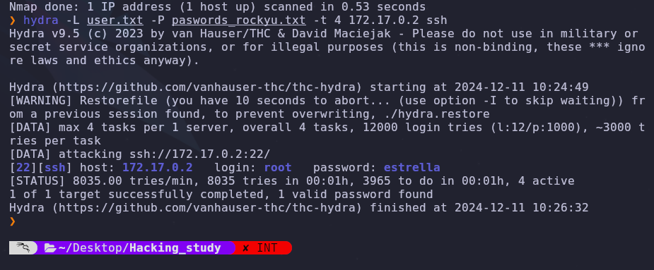
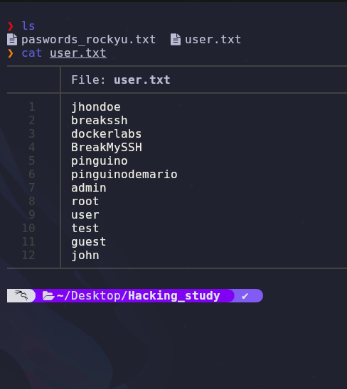
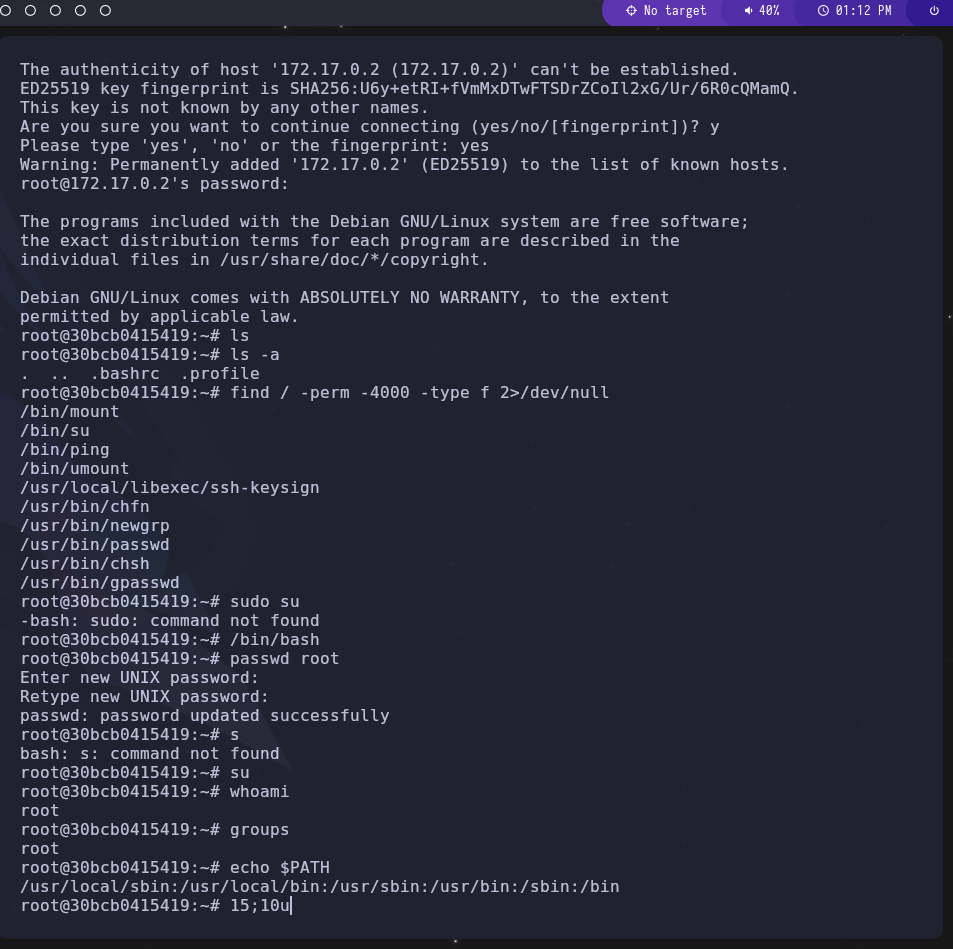

# Maquina breakmyssh Dockerlabs

## Empezamos con Nmap

<p>se Realizo un escaneo de puertos con el siguiente commando utilizando la flag -Pn --open devolviendome los puertos abiertos</p>

```
nmap 172.17.0.2 --open -Pn

```

<p>Obteniendo solo el puerto ssh abierto</p>

## ataque de fuerza bruta Hydra



<p>Se utilizaron archivos de rockyu lo cual se redujo a 1000 claves para una velocidad mas alta tambien se creo un archivo de posibles usuarios comunes</p>



<p>Se obtuvo el acceso instantaneamente con este ataque arrojando el usuario __root__ y la clave __estrella__ ...</p>

### Accediendo al ssh

<p>Se intento acceder obteniendo un error y se procedio hacer la eliminacion del ssh authorized donde se habia hecho una denegacion del servicio ssh</p>

<p>se obtuvo el acceso root</p>


